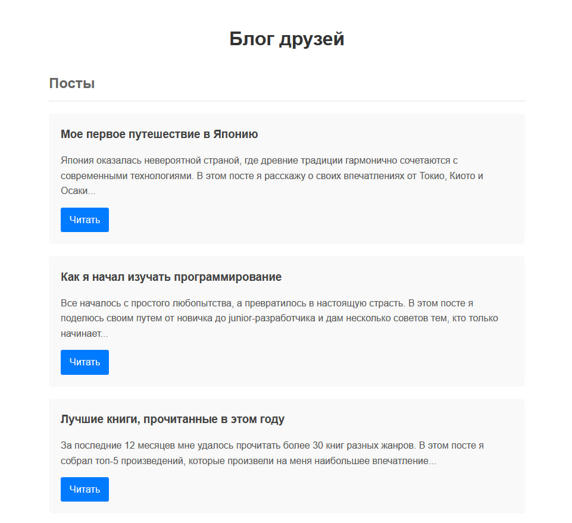
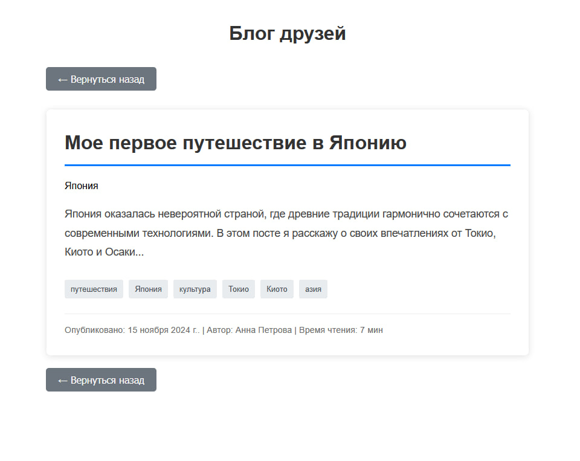
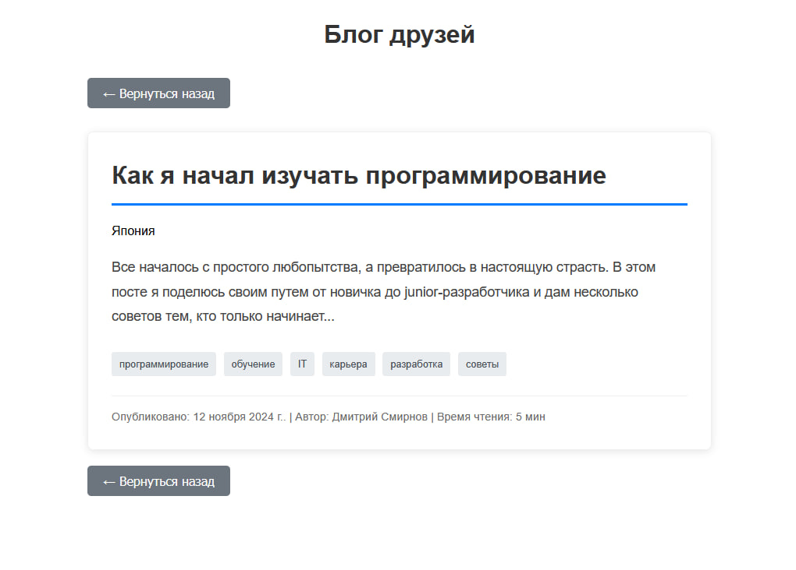

# friendsBlog

Блог друзей

Используемые технологии:
- html
- css
- БЭМ
- PHP
- ООП
- JSON

Что нужно делать:

Создать главную страницу с постами, одну динамическую — "Пост".

Записи блога хранятся в одном JSON-файле. На главной странице выводятся заголовки и анонсы последних записей.

Готовый функционал:
1. Показ всех постов на главной странице
2. Нужная страница Поста с нужными данными

Скриншоты приложения:

